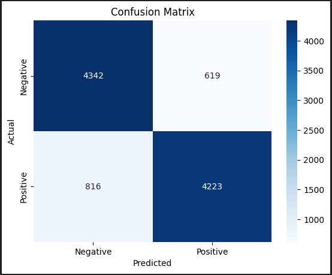
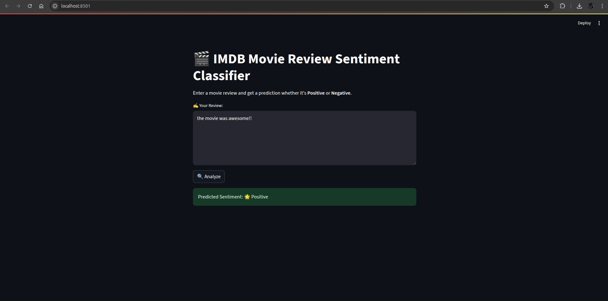

# 🎬 IMDB Sentiment Analysis with Naive Bayes

Welcome to the IMDB Sentiment Analysis project! This repository demonstrates how to perform sentiment classification on movie reviews using the **Naive Bayes** algorithm. The goal is to classify reviews as **Positive (+1)** or **Negative (0)** using classical machine learning and NLP techniques.

---

## 🚀 Project Overview

This project walks through the entire pipeline of:
- Loading and preprocessing the IMDB dataset
- Text vectorization using TF-IDF
- Training a Naive Bayes classifier
- Evaluating the model with precision, recall, and F1-score
- Visualizing results using confusion matrix
- Creating an interactive **Streamlit app** for real-time sentiment prediction

---

## 🧠 Model Details

- **Model**: Multinomial Naive Bayes
- **Accuracy Achieved**: ~86%
- **Classes**:  
  - Negative: **-1**  
  - Positive: **+1**

---

## 📁 Project Structure

```
IMDB_Sentiment_Analysis/
│
├── Assets/
│   ├── Matrix.png        # Confusion Matrix
│   └── UI.png            # Streamlit UI Screenshot
│
├── IMDB_Dataset.csv      # Movie reviews dataset
├── naive_bayes_sentiment.py  # Script for training & evaluating model
├── app.py                # Streamlit app
├── model.pkl             # Saved trained model
├── vectorizer.pkl        # Saved TF-IDF vectorizer
└── README.md             # This file
```

---

## 📊 Confusion Matrix

Visual representation of our classifier’s performance:

<p align="center">
  
</p>

---

## 🌐 Live Demo UI (Streamlit)

A simple and elegant user interface where you can enter a review and get instant sentiment classification.

<p align="center">
  
</p>

---

## ⚙️ How to Run This Project Locally

### 1. Clone the Repository

```bash
git clone https://github.com/yourusername/IMDB_Sentiment_Analysis.git
cd IMDB_Sentiment_Analysis
```

### 2. Create and Activate Virtual Environment

```bash
python3 -m venv venv
source venv/bin/activate
```

### 3. Install Dependencies

```bash
pip install -r requirements.txt
```

<sup>Alternatively, manually install:</sup>

```bash
pip install pandas scikit-learn matplotlib seaborn streamlit
```

### 4. Run Training Script (Optional)

To train and save the model again:

```bash
python3 naive_bayes_sentiment.py
```

### 5. Launch the Streamlit App

```bash
streamlit run app.py
```

Then visit [http://localhost:8501](http://localhost:8501) in your browser.

---

## 📝 Sample Predictions

| Review                                                       | Predicted Sentiment |
|--------------------------------------------------------------|---------------------|
| "The plot was predictable and boring."                       | -1 (Negative)       |
| "I absolutely loved the cinematography and direction!"       | +1 (Positive)       |
| "Waste of time, wouldn't recommend it to anyone."            | -1 (Negative)       |
| "Brilliant performance by the lead actor!"                   | +1 (Positive)       |

---

## 📦 Dependencies

- Python 3.8+
- pandas
- scikit-learn
- matplotlib
- seaborn
- streamlit

---

## 🤝 Contributing

Feel free to fork this repo, submit issues, or send pull requests. Let's collaborate to improve and expand this project.

---

## 📄 License

MIT License. You’re free to use, modify, and distribute this project for personal or commercial purposes with attribution.

---

## 💡 Future Improvements

- Switch to Logistic Regression or SVM for comparison
- Add advanced text cleaning (stopwords, stemming, etc.)
- Deploy the app publicly using Streamlit Cloud or Hugging Face Spaces
- Include neutral class (0) using a tri-class dataset

---

## 👨‍💻 Author

**Ahmed Khan** – _AI & Web Developer_  
📧 [Contact Me](mailto:your.email@example.com)  
🌐 [on5.io](https://on5.io)
